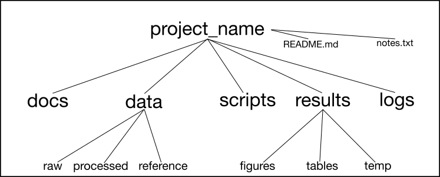

# basics
This is repo for setting up project directory and other basic preparation steps etc.

**proj_str.sh** is bash script that will write structured project directory.
The structure itself is based on paper with sklight modification: 
>https://journals.plos.org/ploscompbiol/article?id=10.1371/journal.pcbi.1000424  

**project_dir.sh** is skeleton of basic bash skript based on recommendation:
>https://docs.e-infra.cz/compute/grid/computing/run-basic-job/#batch-job-example

